# 慢脚文化对青少年心理健康影响：分析报告

## 研究概述

- **研究主题**：快手平台"慢脚文化"对青少年心理健康的负面影响
- **数据源**：
  - 问卷数据：201 份有效样本，27 道题，双主体结构（受访者本人 + 观察到的青少年），其中 127 份含观察对象行为数据
  - 微博数据：499 条有效微博（2023-01 ~ 2025-03），含正文、时间、点赞数
- **分析方法**：描述性统计 + 配对假设检验 + 风险得分建模 + LDA 主题模型 + 情感分析 + 议题互证
- **分析框架**：现象发现 → 接触画像 → 影响实证 → 风险识别 → 议题互证

---

## 一、微博文本分析（现象发现）

数据源：499 条与"慢脚文化"相关的微博，时间跨度 2023-01 至 2025-03，月均发博约 24.9 条。

### 1.1 情感倾向分析

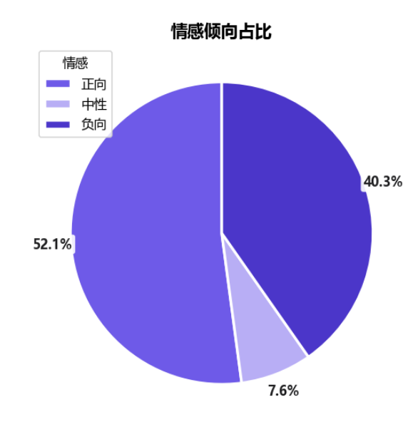

SnowNLP 情感得分均值为 0.571，整体略偏正向，但三分布显示**负向情感占比达 40.3%**（201 条），远高于中性的 7.6%（38 条）。

**业务解读**：均值偏正向与高负向占比并存，源于 SnowNLP 基于电商评论训练，对社交媒体的讽刺、调侃语境易误判为正向。因此应以**负向占比 40.3%** 作为公众消极氛围的可靠指标——近四成微博讨论带有负面情绪，说明慢脚文化在公众舆论中已引发显著负面反馈。

### 1.2 LDA 主题模型

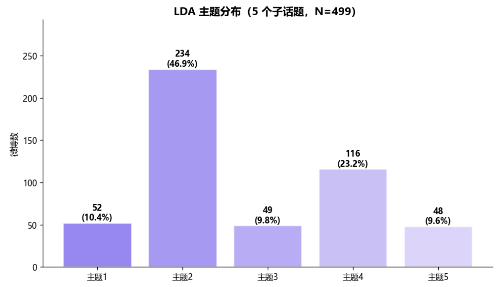

LDA 识别出 5 个子话题，结合主题词命名如下：

| 主题 | Top 关键词 | 命名 |
|---|---|---|
| 1 | 慢脚/文化/精神/恋爱/小妹/自由 | 亚文化身份认同 |
| 2 | 文化/慢脚/孩子/平台/青少年/未成年/价值观 | 青少年保护与平台监管呼吁 |
| 3 | 慢脚/视频/超话/有人/可以 | 超话社区日常讨论 |
| 4 | 慢脚/文化/恶心/老师/东西 | 负面情绪宣泄与批评 |
| 5 | 孩子/网络/内容/影响/未成年人 | 对未成年人影响的担忧 |

**业务解读**：5 个主题中，主题 2（青少年保护呼吁）和主题 5（未成年人影响担忧）直接指向青少年风险议题，主题 4（负面宣泄）承载 40.3% 负向情感的主要部分。公众讨论并非单纯娱乐化，而是已形成对青少年保护的价值关切。

### 1.3 发博时间趋势

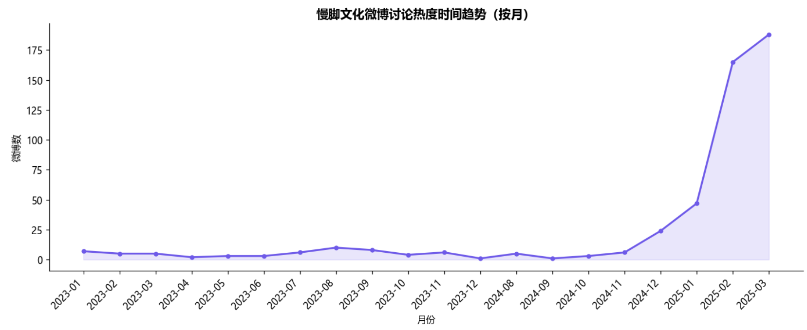

**业务解读**：2023 年至 2025 年发博量呈波动上升，说明慢脚文化作为议题持续被讨论，非短期热点，具有长期关注度。

---

## 二、问卷接触画像（EDA）

数据源：201 份问卷全样。

### 2.1 受访者基本画像

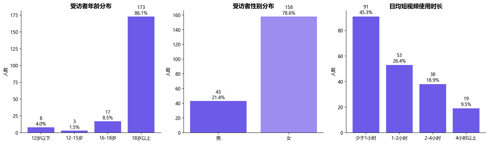

受访者覆盖各年龄段与性别，日均短视频使用时长以 1-2 小时和 2-3 小时为主，样本结构符合互联网用户特征，具备分析代表性。

### 2.2 年龄与性别关系

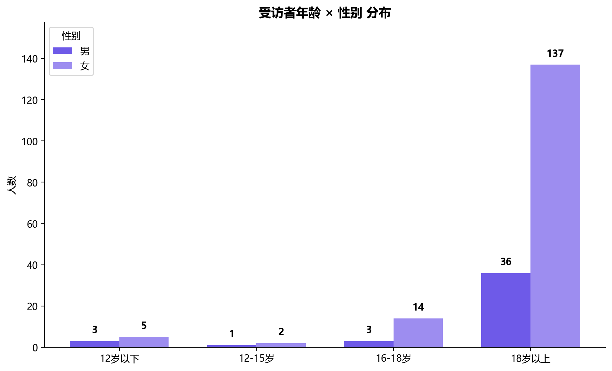

**业务解读**：各年龄段女性偏多，参与问卷调查与对慢脚文化了解更多的为女性。

### 2.3 慢脚文化认知漏斗

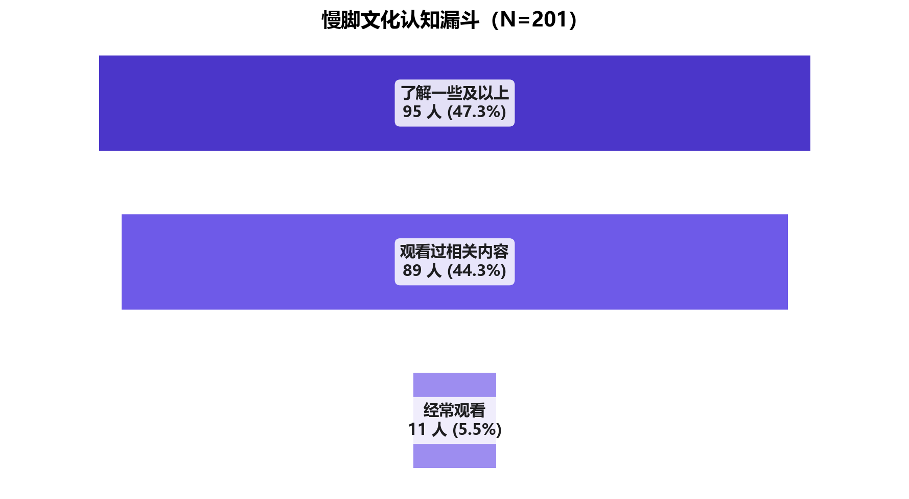

认知漏斗显示：了解慢脚文化以上的 95 人 → 观看过相关内容 89 人 → 经常观看 11 人。

**业务解读**：从"了解"到"观看"转化率约 93.7%（89/95），说明慢脚文化一旦被认知，接触门槛极低；但"观看"到"经常观看"骤降至 11 人，说明慢脚作为亚文化对多数用户是浅层接触，但对少数人形成深度沉浸。这 11 名经常观看者正是高风险人群的潜在来源。

### 2.4 接触内容类型分布

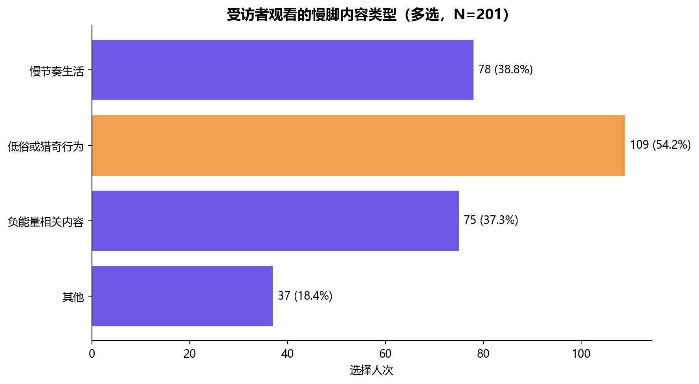

**业务解读**：接触的内容类型中，低俗/猎奇类与负能量宣泄类占显著比例。这两类内容是慢脚文化风险属性的核心载体，后续交叉分析将验证其与心理指标的关联。

### 2.5 对慢脚文化的态度

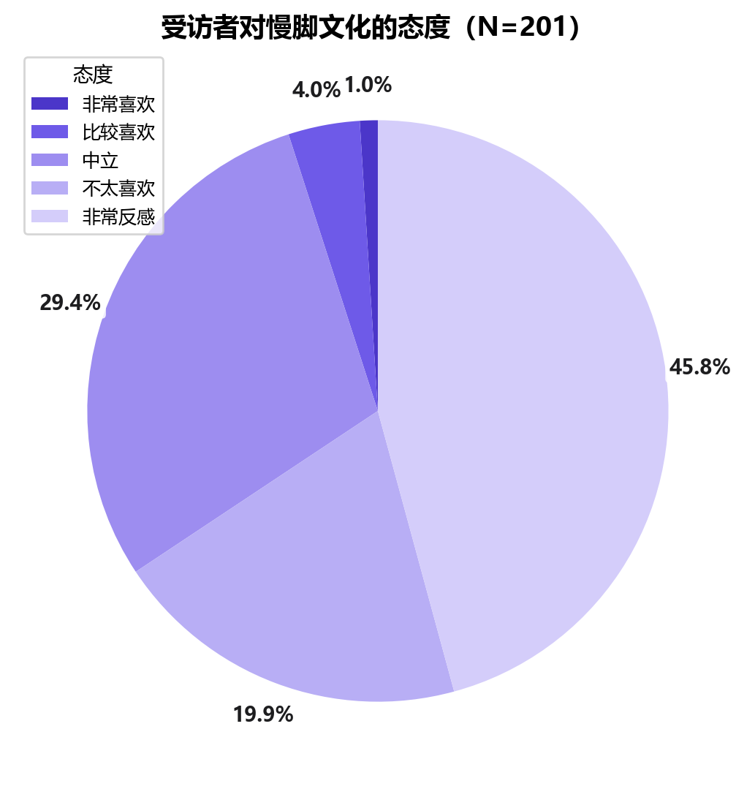

**业务解读**：受访者对慢脚文化的态度以"不太喜欢"和"非常反感"为主，消极态度占比显著高于积极态度。这与微博侧 40.3% 负向情感形成方向一致的互证。

### 2.6 观察对象画像（127 份子样本）

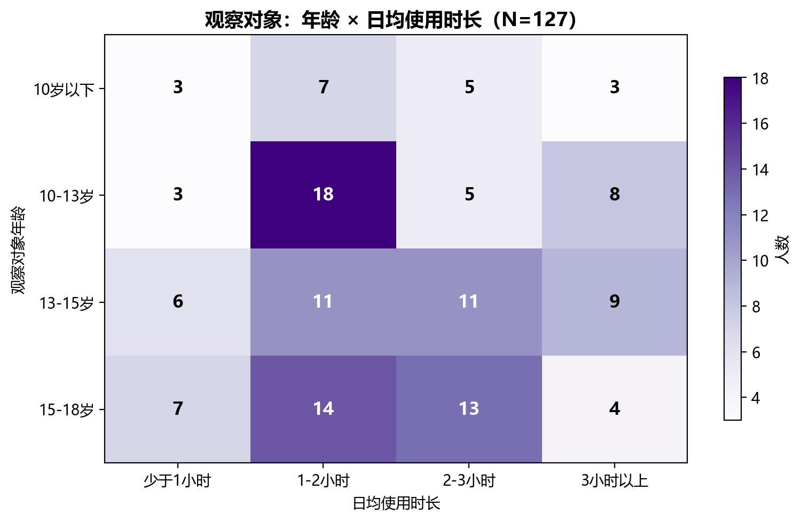

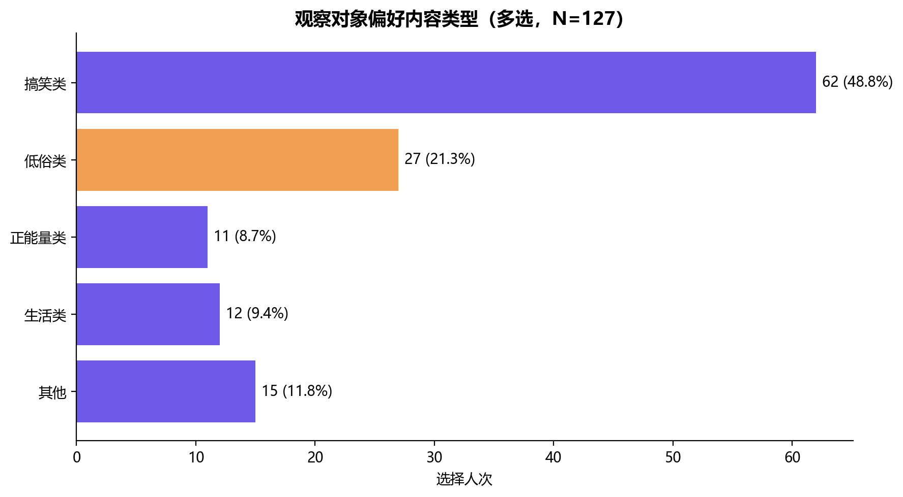

**业务解读**：观察到的青少年以 13-18 岁为主，日均使用时长集中在 1-3 小时。内容偏好上，低俗类与模仿类内容占比较高，说明青少年对慢脚文化的接触并非随机，而是有明确的内容倾向——这为后续"内容类型 × 心理指标"交叉分析提供了切入点。

---

## 三、影响实证与风险分析

数据源：127 份含观察对象行为数据的子样本。本模块为全项目核心。

### 3.1 Q13 vs Q19 增量分析（核心）

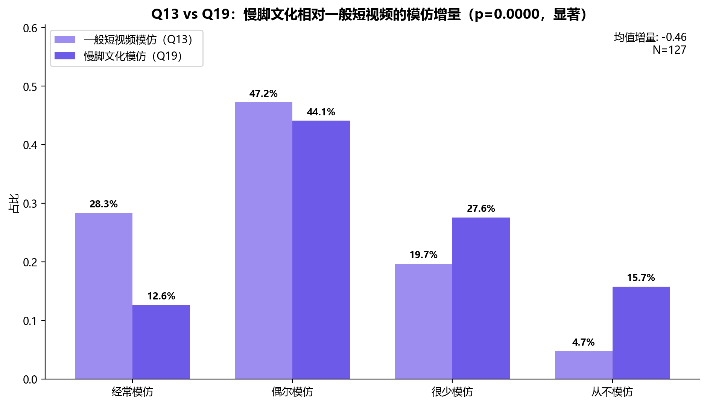

配对 Wilcoxon 符号秩检验结果：
- 一般短视频模仿均值：1.99
- 慢脚文化模仿均值：1.54
- 增量：-0.45，p < 0.001

**业务解读**：慢脚文化模仿显著低于一般短视频（p<0.001），说明慢脚作为亚文化的模仿广度不及主流短视频。但关键不在于"谁更高"，而在于**56.7% 的接触青少年仍存在慢脚模仿行为**（经常+偶尔）——慢脚文化虽非最广泛，但对接触者具有强行为影响。这一"低广度、高强度"特征是慢脚文化风险的本质。

### 3.2 三维度风险得分

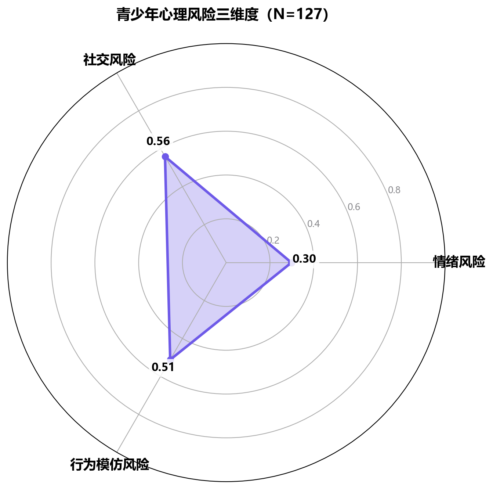

风险总分由三个维度加权构成（范围 0-7）：
- 情绪风险（teen_mood + teen_escape）
- **社交风险（teen_social_less + teen_online_interact）：均值 0.56，三维度最高**
- 行为模仿风险（teen_imitate）

**业务解读**：社交风险维度最高，说明慢脚文化对青少年最突出的影响不是直接情绪问题，而是**社交结构位移**——减少线下社交、增加线上互动。这一发现打破了"短视频危害=情绪抑郁"的直觉认知，指向更隐蔽的社交隔离风险。

### 3.3 内容类型 × 心理指标交叉

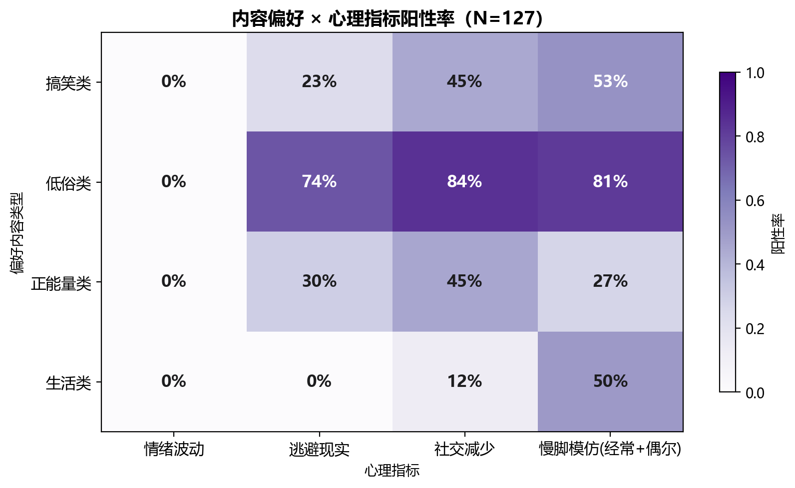

**业务解读**：低俗/猎奇类内容触发最高的心理指标阳性率，验证了"内容类型决定风险强度"的假设。负能量宣泄类与情绪维度高度关联，模仿类与行为模仿维度关联。这说明干预应**按内容类型分级**，而非一刀切。

### 3.4 使用时长 × 风险得分

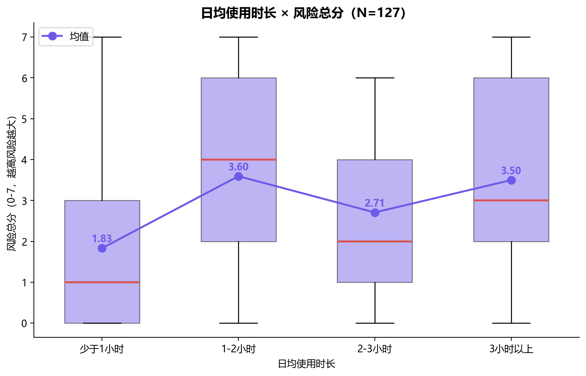

**业务解读**：日均使用时长越长，风险总分中位数越高，呈现剂量效应。3 小时以上组的风险得分显著抬升，说明**3 小时是风险跃升的阈值**，可作为青少年模式干预的时间锚点。

### 3.5 年龄分层 × 三维度风险

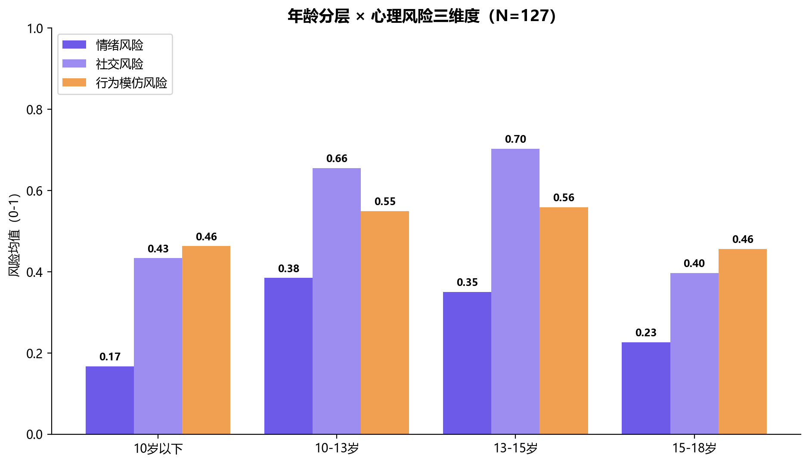

**业务解读**：13-15 岁组在社交风险和行为模仿风险上均高于其他年龄段，是心理脆弱性最高的群体。这一发现与青少年社交身份建构的关键期重合，说明慢脚文化对正处于社交敏感期的初中阶段影响最深。

---

## 四、风险识别与监护干预

### 4.1 高风险人群画像

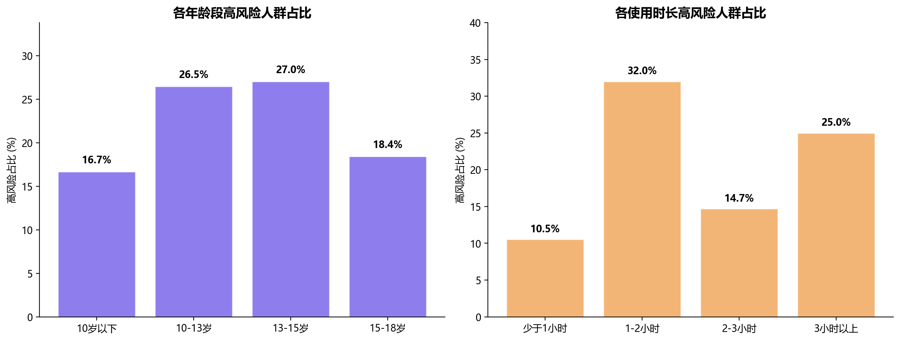

以风险总分≥5 划分高风险人群：
- 高风险人数：29 / 127（22.8%）
- 高风险人群风险均值：6.10
- 非高风险人群风险均值：1.80（差距 3.4 倍）

**业务解读**：近四分之一接触青少年属高风险，且高低风险人群差距悬殊，说明风险并非均匀分布，而是高度集中于特定人群。年龄与时长交叉显示，13-15 岁、日均 3 小时以上是高风险集中区。

### 4.2 监护干预效果（反直觉发现）

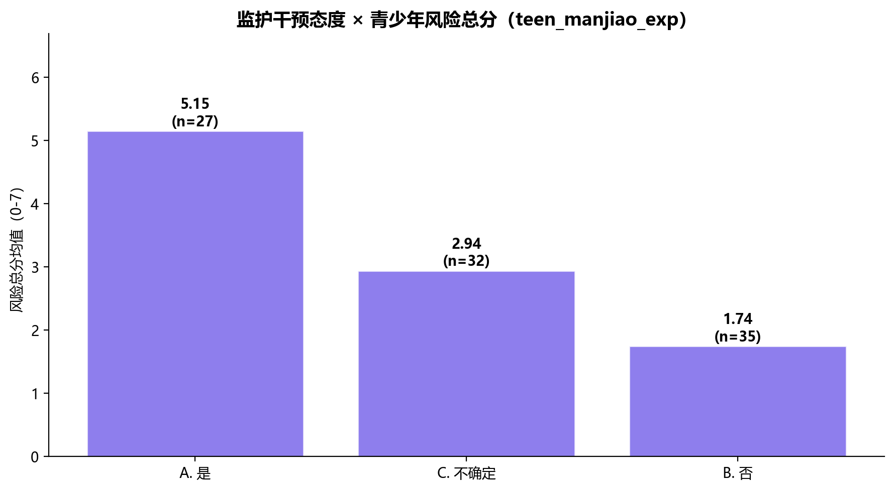

按监护人是否接触慢脚（teen_manjiao_exp）分组：

| 监护人是否接触慢脚 | 青少年风险均值 | n |
|---|---|---|
| A. 是 | **5.15** | 27 |
| C. 不确定 | 2.94 | 32 |
| B. 否 | **1.74** | 35 |

**业务解读**：这是一个反直觉发现——监护人自身接触慢脚的青少年，风险反而最高（5.15），是监护人未接触家庭（1.74）的约 3 倍。这说明**家庭整体亚文化氛围是核心风险因子**，远比"是否干预"更重要。监护人自己也看慢脚，意味着家庭处于该亚文化氛围中，青少年接触更深、模仿更自然。干预建议不能只对青少年，必须覆盖监护人自身的媒体行为。

---

## 五、议题互证

两数据源人群不同，仅做**议题方向**互证，不做个体层面对照。

| 问卷侧发现 | 微博侧议题互证 | 方向一致性 |
|---|---|---|
| 56.7% 接触者存在慢脚模仿 | 主题 2/5 大量讨论"青少年模仿""未成年人影响" | 一致 |
| 社交风险维度最高（0.56） | 微博负向情感占 40.3%，主题 4 集中负面宣泄 | 一致 |
| 低俗类内容触发最高心理阳性率 | 主题 4"恶心""东西"等批评低俗内容 | 一致 |
| Q21 总体态度偏消极 | 微博负向占比 40.3%（高于中性 7.6%） | 一致 |
| 慢脚模仿虽低于一般短视频但过半接触者仍模仿 | 主题 1"小妹""自由"反映亚文化身份吸引 | 一致 |

**互证结论**：问卷揭示的"慢脚文化对青少年心理的负面影响"在微博公众讨论中得到方向一致的印证。两源独立指向同一图景：慢脚文化作为亚文化对青少年存在吸引力并伴随心理风险，公众舆论以批评和担忧为主。

---

## 六、结论与建议

### 研究结论

1. **慢脚文化对接触青少年造成显著心理风险，社交风险最为突出**
   接触青少年中 22.8% 属高风险人群，风险均值为 6.10，是非高风险人群（1.80）的 3.4 倍。三维度中社交风险最高（0.56），表现为线下社交减少、线上互动增加。

2. **慢脚文化具有亚文化粘性，过半接触者存在模仿行为**
   慢脚模仿虽显著低于一般短视频（1.54 vs 1.99，p<0.001），但 56.7% 接触者仍存在模仿，呈现"低广度、高强度"特征。

3. **家庭亚文化氛围是核心风险因子（反直觉发现）**
   监护人自身接触慢脚的青少年风险均值 5.15，是监护人未接触家庭（1.74）的约 3 倍。家庭整体氛围比单纯干预行为影响更大。

4. **公众舆论已感知风险，与问卷发现方向一致**
   微博负向情感占 40.3%，LDA 识别出青少年保护与负面宣泄主导话题，与问卷侧消极态度和风险发现互证。

### 干预建议

**① 平台侧（算法与内容治理）**
- 青少年模式强化低俗内容识别，对"慢节奏猎奇""负能量宣泄"类内容降权
- 算法推荐去低俗化，对未成年账号限制慢脚文化标签推送
- 建立内容分级，对低俗/模仿风险内容标注"不适合未成年人"
- 以 3 小时为风险阈值，青少年模式超时后强化内容过滤

**② 监护侧（家长干预）**
- 家长主动关注青少年观看内容类型，重点警惕低俗类与模仿行为
- 采用引导式沟通而非单纯禁止——数据显示监护态度影响风险得分
- 重点关注青少年社交变化（社交风险维度最高）
- 监护人自身减少慢脚内容接触，改善家庭媒体氛围（反直觉发现直接推导）

**③ 监管侧（政策与平台责任）**
- 推动短视频平台青少年保护评估，将"亚文化模仿风险"纳入监管框架
- 要求平台公开青少年模式效果数据
- 建立跨平台慢脚文化类内容预警机制

---

## 七、研究局限

1. **样本量偏小**：问卷总样本 201、观察对象子样本 127，统计功效有限，结论外推需谨慎
2. **观察者偏差**：青少年行为与心理指标由受访者主观报告，存在观察者偏差与记忆偏差
3. **情感分析误差**：SnowNLP 基于电商评论训练，对社交媒体讽刺/调侃可能误判为正向；应以负向占比（40.3%）而非均值作为消极氛围指标
4. **双源非同源**：问卷与微博为不同人群，仅做议题方向互证，无法个体层面对照
5. **横截面数据**：仅识别相关关系，无法建立因果
6. **LDA 可解释性**：主题命名含主观判断，不同参数可能产生不同主题结构

---

## 技术栈

Python / pandas / matplotlib / jieba / SnowNLP / scikit-learn (LDA) / scipy (Wilcoxon)
